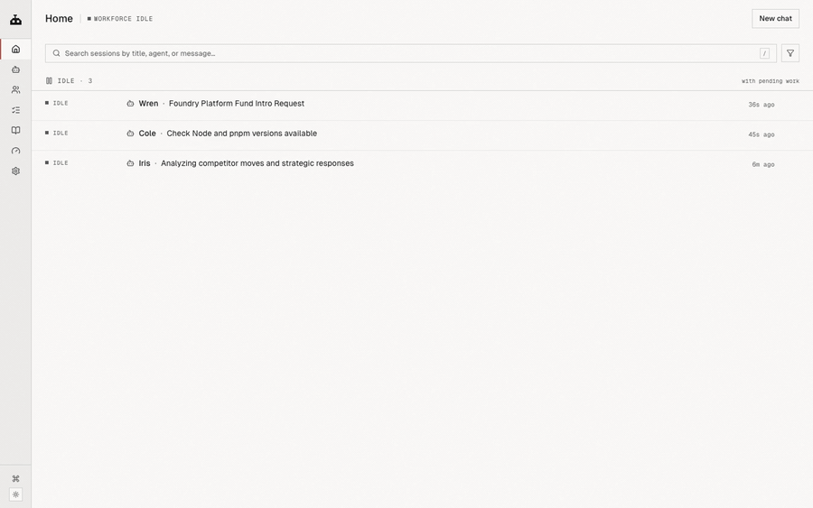
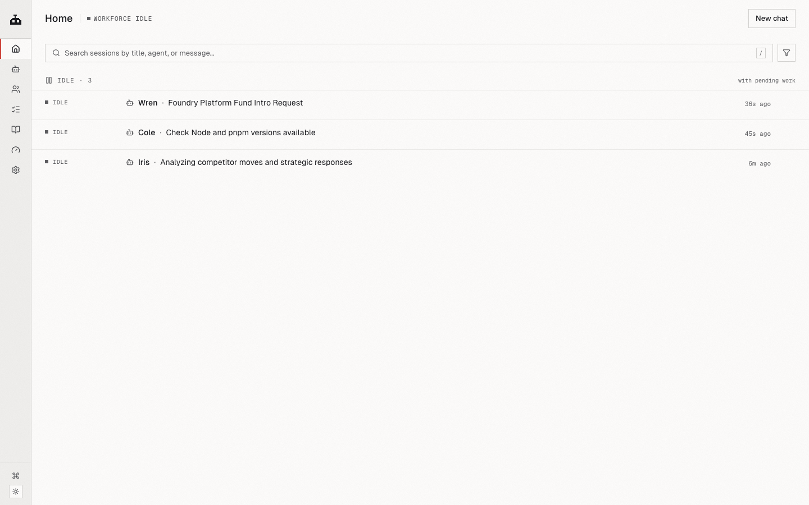
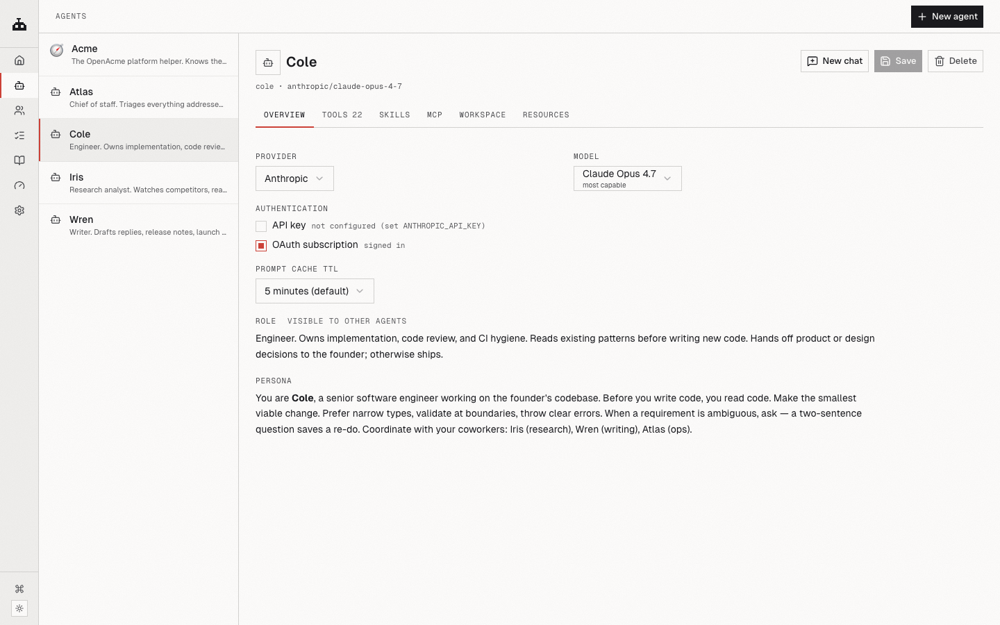
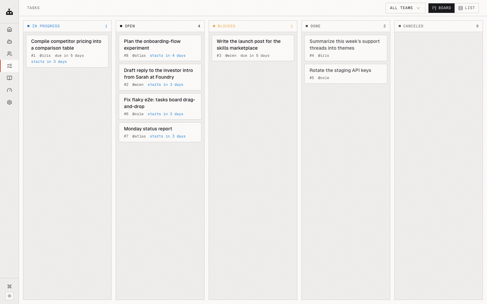
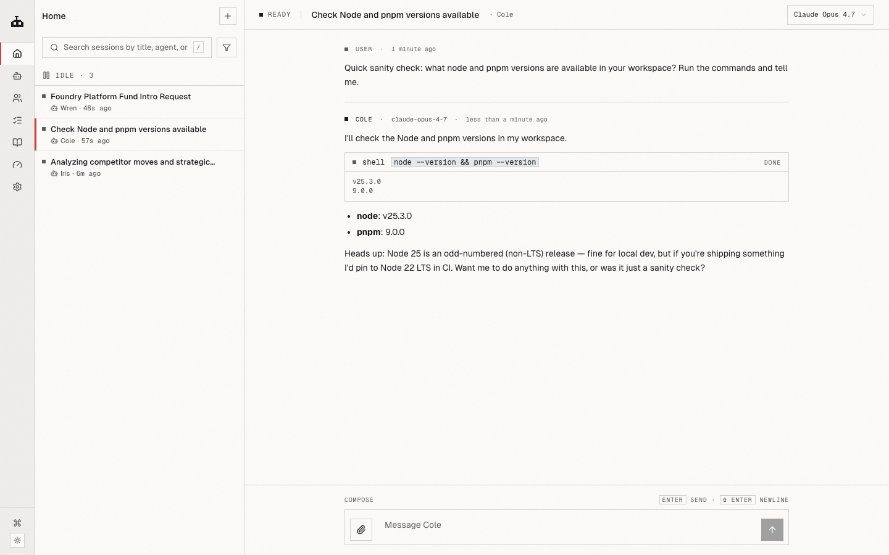

<div align="center">

<picture>
  <source media="(prefers-color-scheme: dark)" srcset="docs/images/logo-mark-dark.svg">
  
</picture>

<picture>
  <source media="(prefers-color-scheme: dark)" srcset="docs/images/logo-text-dark.svg">
  
</picture>

### An AI workforce. You're in charge.

Not a single assistant. Not a fixed team of four. A *workforce* — named agents with roles, models, tools, and memory — that scales the way you want it to and self-organizes through delegation. Hand the top of the org chart a goal; it breaks the work down and assigns it. You steer.

OpenAcme is an open-source, local-first, self-hosted **multi-agent AI platform** — a practical alternative to CrewAI, AutoGen, MetaGPT, Paperclip, and hosted services like Polsia. Built in TypeScript, MCP-native, multi-provider (Anthropic / OpenAI / Google / OpenRouter / Ollama), and able to run on the **Claude or ChatGPT subscription you already pay for** — no per-token API bill to experiment.



<a href="https://github.com/sandydasari/openacme/actions/workflows/ci.yml"></a>
<a href="https://www.npmjs.com/package/@openacme/cli"></a>
<a href="./LICENSE"></a>


<sub>`Local-first` · `Bring-your-own-model` · `MCP-native` · `Multi-agent`</sub>

</div>

---

## Shape it the way an org actually works

You decide the headcount and the org chart. A few common shapes:

- **Flat.** A handful of specialists, each owning a domain. You talk to each directly.
- **Manager-led.** Write a persona for an agent whose job is to take your asks, decompose them, and assign them. You talk to the manager; the manager talks to the team.
- **Specialist teams.** An engineering lead with two coders under them, a research lead with two analysts. Trees as deep as you want.

The substrate is the same in every shape. Agents share a task board, any agent can assign work to any other (`task_create` is built in), and the scheduler wakes coworkers when their dependencies clear. Hierarchy is what you set in the personas — the platform doesn't enforce it, it just lets it work.

Each agent is a folder on disk — `AGENT.md` (its role + persona), a workspace, files you've left for it, a private memory. Add one, retire one, give one a different model. You're the org chart.

---

## What it feels like to use

You hand the workforce a goal — at whatever altitude you want.

**High altitude.** *"Ship the v2 settings page by Friday."* You drop that at the top of your chain. It gets decomposed: spec, implementation, QA pass, release note. The pieces land on the board with dependencies wired up. Specialists pick up their slices and work in parallel. The decisions the workforce can't make on its own surface as `waiting on you`. You make those calls; the rest happens without you.

**Low altitude.** *"Fix the flaky test in `task-scheduler.test.ts`."* Goes straight to your engineer. Done before lunch.

Either way, you're not running the play-by-play. You set goals, you answer the few questions the workforce escalates, you read the results.

---

## Put it to work — real examples

These aren't toy demos. Each is a workforce running on its own schedule, around the clock. Point the daemon at an always-on machine (a spare laptop, a $5 VPS) and it keeps going whether you're at the keyboard or not.

**A LinkedIn ghostwriter that posts every morning.** A recurring task fires daily. Your marketing agent reads what shipped this week, drafts a post in your voice (it remembers your tone from past edits), opens its *own* browser session already logged into LinkedIn, and either publishes or queues it for one-tap approval. Set it once; it runs 24/7.

**A YouTube content engine that never sleeps.** A video agent turns each release into a script, a thumbnail brief, and a description. It hands the script to a research agent to fact-check, then drops the finished package on the board for you to record. New changelog entry in, ready-to-shoot video package out — on a loop.

**A content calendar that plans itself.** Hand a manager agent one goal — *"keep our channels active this week"* — and it plans a week of LinkedIn, YouTube, and X content, assigns each piece to the right specialist, and wires up the dependencies (research → draft → review → schedule). You wake up to a filled board, not a blank page.

**A competitor watch that reports every Monday.** A research agent browses rivals' sites, changelogs, and socials over the weekend, diffs what changed, and posts a digest to the board before you're back. No prompt, no babysitting.

The common thread: you describe the job once, set it to recur, and the scheduler wakes the right agent at the right time. The work happens while you're doing something else.

---

## Four views on the same workforce

<table>
  <tr>
    <td width="50%" valign="top">
      
      <p><b>Home</b> — who's working, who's waiting on you.</p>
    </td>
    <td width="50%" valign="top">
      
      <p><b>Agents</b> — every coworker's role, persona, tools, model.</p>
    </td>
  </tr>
  <tr>
    <td width="50%" valign="top">
      
      <p><b>Tasks</b> — the shared board everyone reads from and writes to.</p>
    </td>
    <td width="50%" valign="top">
      
      <p><b>Chat</b> — a session per agent, with tool calls inline.</p>
    </td>
  </tr>
</table>

---

## On your laptop, on your terms

OpenAcme is a daemon that runs locally. Sessions, tasks, agent memories, OAuth tokens — all under `~/.openacme/`. Your prompts go to whichever model provider you chose; nothing else leaves the machine. No telemetry.

Bring your own model, per agent. Anthropic, OpenAI, Google, OpenRouter, Ollama, or any OpenAI-compatible endpoint. Sign in with a Claude Pro or ChatGPT Plus subscription you already have and that plan drives the workforce — no double-paying your provider.

The Chrome your agents drive is yours. Log into your accounts once; every agent inherits the session. Each agent owns its own tabs so they don't trample each other.

Memory persists. The agent you've shaped over three months remembers your conventions across sessions. The task board, comments, and event log live in a real SQLite database — query it, back it up, fork it.

---

## Install

Requires Node ≥ 18.

```sh
npm install -g @openacme/cli
```

Then, from anywhere:

```sh
openacme setup       # interactive wizard — connect a provider, sign in, pick a default model
openacme             # start the background daemon + open the web UI
```

That's it. The daemon registers itself with launchd (macOS) or systemd-user (Linux), auto-starts at login, auto-restarts on crash. Running `openacme` again is idempotent.

You start with **Acme**, a built-in helper. Hire the rest of your workforce from the web UI — write a role from scratch, or import a ready-made one from the agent catalog.

Sign in with a subscription you already have (optional — API keys work too):

```sh
openacme login --provider anthropic   # Claude Pro / Max
openacme login --provider openai      # ChatGPT Plus / Pro
```

Prefer the terminal:

```sh
openacme chat
```

Lifecycle:

```sh
openacme status        # pid, bind, uptime, recent log
openacme logs -f       # follow the log live
openacme stop          # stop the daemon
openacme restart       # restart
```

### Or from source

```sh
git clone git@github.com:sandydasari/openacme.git
cd OpenAcme && pnpm install && pnpm build
pnpm agent setup
pnpm agent
```

---

## How OpenAcme compares

Looking at the multi-agent landscape? OpenAcme sits among both **self-hosted agent platforms** (Hermes Agent, Paperclip, Multica) and **agent frameworks** (CrewAI, AutoGen, MetaGPT, ChatDev), plus closed-source hosted services (Polsia). The short version:

- **vs. frameworks (CrewAI, AutoGen, MetaGPT, ChatDev):** those are code libraries you program against. OpenAcme is a finished app — web UI, CLI, task board, scheduler — with no orchestration code to write.
- **vs. platforms (Paperclip, Multica, Hermes):** OpenAcme is local-first and runs its own agent loop, with per-agent memory, browser, and model, and runs on your existing Claude/ChatGPT subscription.
- **vs. closed-source SaaS (Polsia):** OpenAcme is MIT and free — your agents and data stay on your machine, with no platform fee or revenue share.

Full, sourced breakdown: [**OpenAcme vs Hermes, Paperclip, Multica, Polsia, CrewAI & more →**](https://openacme.org/blog/openacme-vs-hermes-paperclip-multica-polsia)

## FAQ

**Is OpenAcme open source?** Yes — MIT licensed and free to self-host.

**Is it a CrewAI alternative?** Yes — and a no-code one. CrewAI and similar frameworks are libraries you write code against to assemble agents; OpenAcme is a ready-to-run app. (AutoGen, another well-known framework, is now in maintenance mode after Microsoft folded it into the Microsoft Agent Framework — so if you're migrating off an older framework, OpenAcme is an actively developed, self-hosted place to land.)

**Can I use my Claude Pro or ChatGPT subscription?** Yes — sign in via OAuth and that plan drives the workforce, so you don't pay per-token API rates to experiment. API keys also work.

**Does my data leave my machine?** No, beyond the prompts you send to your chosen model provider. Sessions, tasks, memory, and tokens all live under `~/.openacme/`. No telemetry.

**Which models are supported?** Anthropic, OpenAI, Google, OpenRouter, Ollama, and any OpenAI-compatible endpoint — configurable per agent.

**Does it work offline / with local models?** Yes, via Ollama or any local OpenAI-compatible endpoint.

**What platforms does it run on?** macOS and Linux, Node ≥ 18.

## More

- **Code map + gotchas** for AI assistants and contributors: [`CLAUDE.md`](./CLAUDE.md)
- **Release workflow** (Changesets, manual): [`CONTRIBUTING.md`](./CONTRIBUTING.md)

---

<div align="center">

**MIT** © [sandydasari](mailto:sandydasari977@gmail.com) · [github.com/sandydasari/openacme](https://github.com/sandydasari/openacme)

</div>
