Two workers pick up the same ticket. Each does the work, neither knows about the other, and now you have two half-right answers and a quiet argument about which one is real. Nobody designed that. It just happens the moment two people can act on the same thing without checking with each other first. Every team learns this and builds rituals against it: standups, locks, the one person who owns the deploy. The rituals are not bureaucracy. They are the cost of having more than one actor touch the same state.

I built the maximal version of this with language models instead of people, and most days I would talk you out of needing it. That is the honest position, and I want to earn it rather than just assert it.

In June 2025 the argument about multi-agent systems happened in public, fully formed, inside a single day. Cognition published "Don't Build Multi-Agents." Anthropic published "How we built our multi-agent research system." One day apart.[^1] Two serious teams, looking at the same technology, reached opposite conclusions in the same week. That should tell you the question is not settled by intelligence or taste. It is settled by what you are doing with it, and the two posts were quietly about different work.

People reach for multiple agents because one model running alone feels limited, and adding a second one feels like adding a second person to a project: more hands, more throughput. That intuition is wrong in a specific way, and the way it is wrong is the whole story.

## So where does the cost actually go?

The expensive part of a multi-agent system is not the models. It is coordination. And coordination is not a tax you can design away with a cleverer architecture. It is intrinsic, and it grows faster than the number of actors you add.

Watch how fast it grows. Two actors have one relationship to keep consistent. Add a third and you have not added one relationship, you have added three. Add a fourth and you are at six. The work of keeping everyone in agreement climbs faster than the headcount that is supposedly doing the work, because every new actor can interact with every actor already there. You are not buying throughput in proportion to the agents you add. You are buying overhead in proportion to the pairs.

*Add one agent. The team grows by one; the connections it has to keep in sync grow by the whole team.*

Here is the asymmetry that runs the whole thing. Reads parallelize. Writes conflict. Ten agents reading the same document is free; you can have a hundred, a thousand, and it costs you nothing but the reading. Two agents writing to the same document is a negotiation, and the negotiation is the bill. You can feel this in any system you have ever run. A job waits on another job that is, in turn, waiting back on the first, and nothing moves; you have built a deadlock without ever typing the word. One shared login gets rate-limited and every task that depended on it fails at the same instant, because they were never really independent, they just looked independent until the thing they shared ran out. A flaky step retries forever and burns money until a human notices and kills it. None of these are model failures. The model was fine. The cost lives in the system around the model, and it is proportional to how much the actors share, not how smart they are.

*The same asymmetry, drawn out. Two agents write the same record as different shapes, a third tries to reconcile them, and the writes cascade into incompatible schemas and broken endpoints. Reads combine cleanly; writes do not.*

Anthropic was direct about the price. Their multi-agent setups used about fifteen times more tokens than an ordinary chat.[^2] I read that number as the coordination tax made visible. Every agent has to re-establish context the others already have, restate what it is doing, and be told what changed while it was busy. The work the user asked for is a fraction of the tokens. The rest is the actors keeping each other in sync.

I have started calling the long-run version of this agent debt. Not the cost of building the system but the cost of keeping it coherent forever. Every additional loop that can act on shared state is one more thing that can drift, one more way to recreate the two-workers-one-ticket problem, one more reason you wake up to a state nobody intended. You do not pay agent debt once. You pay it every day the system runs, and it compounds with the number of actors who can write.

So you do not out-think a coordination problem. You cannot buy your way out with a smarter model, because the smarter model does not make the writes stop conflicting. The only two moves that actually reduce the cost are to remove actors, or to remove what they share. Everything else is rearranging the negotiation.

## So a better model means fewer agents, not more

This is the part that runs backward from the intuition. The whole reason to split work across several agents was that one of them could not hold it all. The context was too big, the task too broad, the job too long for a single loop to keep in its head. Multiple agents were a workaround for a limit.

So when the model gets better, the case for multiple agents gets weaker, not stronger. A more capable model holds more, reasons further, stays coherent longer. It dissolves the exact limitation that justified splitting the work in the first place. The frontier model does not make coordination cheaper. It makes coordination less necessary. Every leap in capability is, quietly, an argument for using fewer agents, because the reason you reached for more of them was scarcity, and the scarcity is what just got relieved.

This is why I distrust most of what gets sold as multi-agent. There is a thing worth naming as agentwashing, where a perfectly good program gets dressed up in the language of agents because that language is what is funded this year. It is worth deflating, because the deflation is also a test you can run.

Take your system. Rename every agent in it a "function." Strip the names, the roles, the personas, all the theater. A planner becomes `plan()`. A researcher becomes `research()`. A writer becomes `write()`. Now look at what is left and ask whether it still does the same thing. If `plan()` calls `research()`, gets a value back, hands that value to `write()`, and you can reason about the whole thing as one program with some slow, fallible subroutines, then you never had a multi-agent system. You had a program written in an unusual notation. One thing decided what happened next and called out to other things to do bounded, stateless pieces of it; those other things answered and went away. That is an orchestrator and a pile of tool calls, and it is a completely good thing to be. It is, in fact, what most systems should be. Programs are things we know how to make correct.

The interesting case is the one where the renaming breaks. Where `research()` and `write()` are both running at once, both reaching into the same shared state, neither waiting on the other's return value, each one's behavior depending on what the other did a moment ago. That is when you have actually built a multi-agent system, and it is the only place where all that coordination cost is buying you something. Everywhere else, the costume is the only multi-agent thing about the system, and that is good news hiding as bad news. Programs are far easier to keep correct than negotiations.

And this is not just my experience talking. When researchers at Berkeley hand-annotated 1,642 failures from seven multi-agent frameworks, the two biggest causes were bad system design and agents talking past each other, and not one of the fourteen failure modes they catalogued was the model reasoning poorly.[^6] The thing you reach for a smarter model to fix is not even on the list.

## So when do you actually need them?

I owe you the honest version, because the maximal system I built is overkill for almost everyone, including me on most days, and I would rather say that than sell it.

There is a real band where the extra actors pay for themselves, and it has two shapes worth telling apart. The first is the easy one, and it is the one the public numbers are about: work that is mostly reading. When the job is to explore many directions at once and the material is larger than any single context can hold, you can point a dozen agents at it and let them read in parallel, because reads do not collide. Anthropic's research setup beat their single strongest agent by 90.2% on their internal breadth-first evaluation.[^3] Simon Willison, skeptical for a year, flipped the day after the dueling posts and scoped his conversion to exactly this: breadth-first, heavily parallel, beyond-one-context work.[^4] This shape is real. It is also the least interesting, because it works by avoiding the hard part. Nobody is writing, so there is nothing to keep in sync.

The second shape is the one worth building for, and it is harder for every reason in the first half of this essay. Some work is genuinely too large and too structured for one mind to hold, and not because the context window is small. It has many interdependent parts, real division of labor, specialization that cannot be flattened into a single prompt, and it runs longer than any one session. It is the size of an organization rather than a task, the kind of thing you would staff with a team and not a person. This is the case where the costume test breaks: rename the agents functions and the program stops making sense, because they are not subroutines returning values, they are specialists holding context and authority that no one of them could hold alone. Here you do not get to avoid coordination, and you should not try. You build structure for it on purpose: roles with their own context and tools, clear ownership of who decides what, an organizing layer whose whole job is to hand out work and reconcile the writes so the actors do not trample each other. Cognition, who wrote the original "don't," came back in April 2026 to the same design from the inside: the structured systems that hold up are the ones where the writes stay single-threaded and the extra agents contribute intelligence rather than actions.[^5] The coordination cost is exactly the superlinear cost I warned you about. The difference is that the work cannot be done without paying it, so you pay it deliberately, and you get back what a single loop never could: many specialists holding far more than one mind ever could, kept coherent by a structure you designed instead of one that emerged by accident. That is the frontier, and most of it is unbuilt, because it is hard.

The discipline is knowing which shape you are in, because almost everyone who believes they are in the second is in the first, or in neither. The structure is earned by the work being genuinely irreducible, not by how satisfying it is to build. If you can flatten it into one prompt, flatten it. If you can serialize it through one loop, serialize it. You buy the organization only when the work refuses to collapse.

The one place it earned its keep was building the thing itself. OpenAcme is partly built and run by agents inside OpenAcme: one writes the code, one manages the releases, and a coordinating agent with its own memory tracks what is half-finished and what is waiting on what. The work never sits still, because a bug a user files turns into code, turns into a release, turns into the docs, turns into the reply to the person who filed it. I ran it first as one careful loop, and it failed in a way I did not expect. It was not too slow. A single mind holding all of it produced averaged judgment. The context that had just read a furious bug report wrote timid, defensive code; the one still deep in a refactor answered users like a compiler. Splitting the work into separate agents, each with its own memory and its own narrow job, was never about throughput. It was about keeping the engineering caution, the release discipline, and the user's voice from collapsing into one grey middle. And this is the version a bigger model does not dissolve: give one agent ten times the context and it still averages the roles it is holding. The separation has to be real, not just roomy. I could not partition the work either, because that one bug report moved through all of it, and the seams between the roles were exactly where the value lived. Each agent got its own identity, its own workspace, and its own memory, so the only state they shared was the code and the tracker, and they reached even that through the coordinating agent, one write at a time. That is the lesson I did not expect: the moment the work stops being read-only, a shared identity and a shared workspace are exactly where two writers collide.

*How the write-heavy case actually works: each agent keeps its own identity and workspace, writes only its own and reaches shared state as itself, one write at a time through the coordinator, while reads run in parallel. Permissions, not trust, keep the writes from colliding.*

So the engineering forks, depending on which shape you are in. For almost every system, the best work you can do makes the agents behave like one careful actor: serialize the writes, shrink the shared state, let a single mind hold as much as it can and split only what it provably cannot. For the rare system that is genuinely the size of an organization, the work is the opposite and much harder: building the structure that lets many specialists stay coherent without one mind holding it all. That second problem is the real one, and it is why I build OpenAcme, a self-hosted platform in this category.

And when the best version of your design keeps collapsing back toward a single writer, it is not failing to be multi-agent. It is showing you what it always wanted to be.

[^1]: Walden Yan, "Don't Build Multi-Agents," Cognition, June 12 2025; "How we built our multi-agent research system," Anthropic, June 13 2025.

[^2]: Anthropic reports that multi-agent systems use about 15x more tokens than chats. The related claim that token usage explains roughly 80% of performance variance is scoped specifically to the BrowseComp browsing benchmark, not to multi-agent systems in general.

[^3]: Anthropic: a lead agent (Opus 4) coordinating subagents (Sonnet 4) outperformed a single-agent Opus 4 by 90.2% on their internal breadth-first research evaluation.

[^4]: Simon Willison, "OK, I'm sold on multi-agent LLM systems now," June 14 2025, with his endorsement scoped to breadth-first, heavily parallel, beyond-one-context work.

[^5]: Walden Yan, "Multi-Agents: What's Actually Working," Cognition, April 22 2026. The original observations still hold for parallel-writer swarms; the approach works best when writes stay single-threaded and the additional agents contribute intelligence rather than actions. A refinement, not a retraction.

[^6]: Mert Cemri et al., "Why Do Multi-Agent LLM Systems Fail?", UC Berkeley, March 2025, the MAST taxonomy. 1,642 annotated traces across seven frameworks, with failures dominated by system design and inter-agent misalignment rather than single-agent capability. [arXiv:2503.13657](https://arxiv.org/abs/2503.13657).
